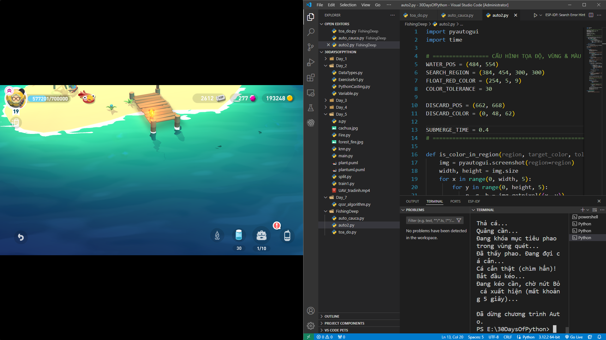
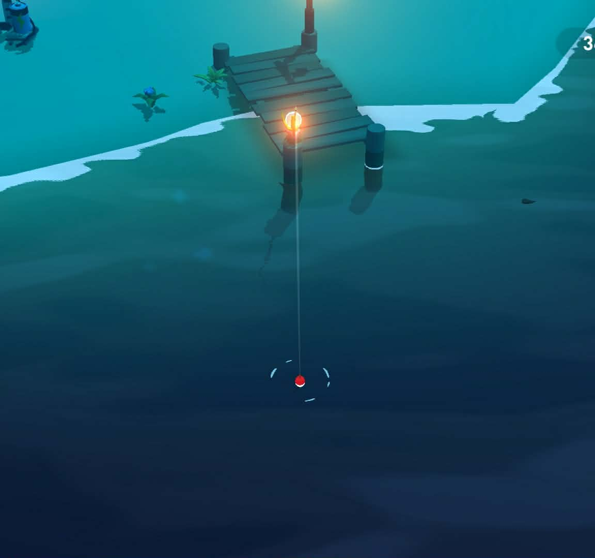

# Hướng Dẫn Sử Dụng Tool Auto Câu Cá Python

Bộ công cụ gồm 2 script Python giúp bạn tự động hóa việc câu cá trong game thông qua cơ chế nhận diện màu sắc pixel và tọa độ chuột, đảm bảo an toàn tuyệt đối vì không can thiệp vào bộ nhớ game.


---

## 📁 Cấu trúc kho lưu trữ (Repository)

* `toa_do.py`: Script phụ trợ giúp quét tọa độ chuột và mã màu RGB theo thời gian thực.
* `auto_cauca.py`: Script chính thực hiện toàn bộ quy trình auto câu cá, chống kẹt UI và tự động nắn nhịp.
* `README.md`: Hướng dẫn sử dụng.

---

## 🛠 Bước 1: Cài đặt môi trường (YÊU CẦU Ở BƯỚC NÀY LÀ CHẠY ĐƯỢC HELLO WORLD BẰNG PYTHON, SAU ĐÓ MỚI LÀM BƯỚC TIẾP THEO)

1. **Cài đặt Python:**
   - Tải và cài đặt phiên bản Python mới nhất từ trang chủ [python.org](https://www.python.org/downloads/).
   - **LƯU Ý QUAN TRỌNG:** Ở màn hình cài đặt đầu tiên, nhớ tích chọn ô **Add Python.exe to PATH**.

2. **Cài đặt thư viện phụ thuộc:**
   - Mở **Command Prompt (CMD)** hoặc **Terminal** trên máy tính.
   - Chạy lệnh sau để cài đặt thư viện điều khiển chuột/màn hình:
     ```bash
     pip install pyautogui
     ```

---

## 🎯 Bước 2: Lấy tọa độ và mã màu (Sử dụng script 1)

Mở game trên máy tính ở chế độ toàn màn hình, sau đó thực hiện chia đôi màn hình, bấm Windows + <-, bên trái là màn hình game, bên phải là màn hình chạy code 

<p align="center">
  
</p>

Có thể chạy code auto_cauca.py lần đầu tiên để xem code có hoạt động không, nếu không ổn, chạy code toa_do.py và làm theo hướng dẫn

Vị trí câu: cây cầu ở đảo nhà, ra đứng như hình và bấm run code lấy tọa độ


<p align="center">
  
</p>

Vì mỗi màn hình có độ phân giải, cũng như tọa độ khác nhau, bạn cần lấy thông số chính xác trên máy của mình bằng cách chạy đoạn code lấy tọa độ (`lay_toa_do.py`):

```python
import pyautogui
import time

print("Di chuột đến vị trí cần lấy. Nhấn Ctrl + C trong Terminal để dừng.")
try:
    while True:
        x, y = pyautogui.position()
        color = pyautogui.pixel(x, y)
        print(f"Toạ độ: X={x:4d}, Y={y:4d} | Màu RGB: {color}", end="\r")
        time.sleep(0.2)
except KeyboardInterrupt:
    print("\nĐã dừng.")
```

* **Tọa độ mặt nước (`WATER_POS`):** Rọi chuột vào vị trí phao rơi xuống nước (vị trí muốn câu, ghi lại tọa độ x, y).
* **Mã màu phao (`FLOAT_RED_COLOR`):** Quăng cần, đợi phao nổi lên và chỉ chuột vào phần đỏ nhất của phao(ghi lại thông số R, G, B).
* **Tọa độ nút thả cá (`DISCARD_POS`):** Đưa chuột vào nút Thả/Bỏ cá khi bảng tổng kết xuất hiện(ghi lại tọa độ x,y, RGB).

---

## ⚙️ Bước 3: Cấu hình file Auto chính

Mở file `auto_cau_ca.py`, thay thế các thông số cấu hình ở đầu file theo kết quả bạn vừa đo được:
Dưới đây là thông số tác giả đã thực hiện thành công, không đảm bảo sẽ thành công ở máy khác

```python
# ================= CẤU HÌNH TỌA ĐỘ, VÙNG & MÀU SẮC =================
WATER_POS = (466, 595)  # Tọa độ click quăng/thu cần
SEARCH_REGION = (316, 445, 250, 250) # Vùng quét tìm phao (X-250, Y-250, Rộng, Cao)
FLOAT_RED_COLOR = (213, 17, 36) # Mã màu RGB của phao đỏ
COLOR_TOLERANCE = 50               

DISCARD_POS = (662, 668) # Tọa độ nút bấm bỏ cá
DISCARD_COLOR = (0, 48, 62) # Mã màu nhận diện nút bỏ cá

SUBMERGE_TIME = 0.2
MAX_WAIT_BITE = 30
# ===================================================================
```

---

## 🚀 Bước 4: Vận hành Tool

1. Mở game và đưa nhân vật vào góc độ câu cá cố định như lúc bạn đo tọa độ.
2. Chạy file `auto_cauca.py`. Máy tính sẽ bắt đầu làm việc sau 3s
3. **Cách tắt khẩn cấp:**
   - Nhấn tổ hợp phím `Ctrl + C` trong cửa sổ Terminal/CMD.
   - Hoặc vẩy mạnh chuột ra một trong các góc sát màn hình để kích hoạt tính năng an toàn Fail-Safe của PyAutoGUI.